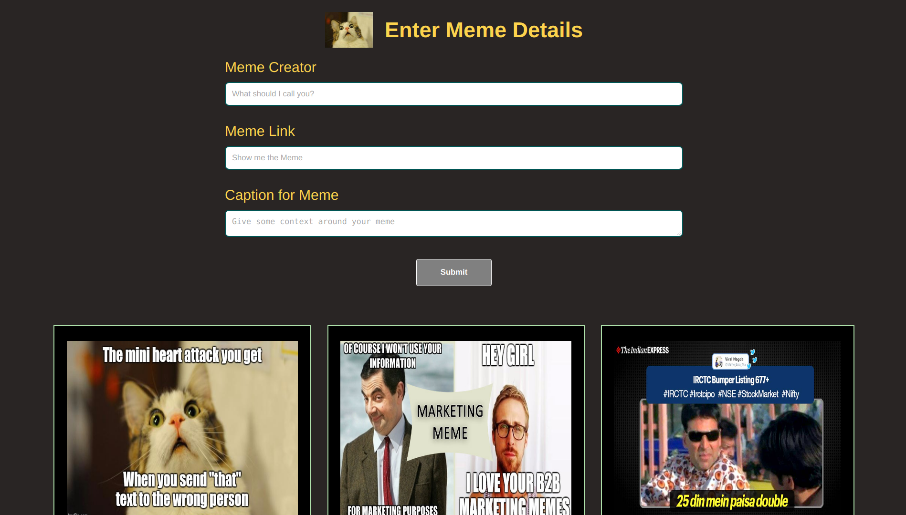

# MEME STREAM APP

## Introduction

This repository consists of backend and frontend code of meme streaming application. It is hosted on Vercel and Heroku
It is made using `HTML, CSS, JavaScript, React, Node, Express, PostgreSQL`  to design and develop this application.

## Live Demo

View the recorded video of the application here 👉 [meme-app](https://youtu.be/Jy9TqDegyFI)

View the live demo of the application here 👉 [meme-stream](https://meme-app.jaynil1611.vercel.app/)

Backend is hosted on Heroku app 👉 [heroku-backend](https://xmeme-0.herokuapp.com/memes)

## Application View

## Technologies Used

- HTML
- CSS
- JavaSript
- React
- Node
- Express
- PostgreSQL

## Run Application

- Clone the repository
- Go to the cloned folder
- Install `postgresql` in your local machine
- Create a local database using `init.sql` [here](./meme-backend/init.sql).
- Run the `npm install && npm start` in meme-frontend and meme-backend folders to get started

## 👤 **Jaynil Gaglani**

- Portfolio: [jaynil.gaglani](https://jaynil-profile.netlify.app/)
- Linkedin: [Jaynil Gaglani](https://www.linkedin.com/in/jaynilgaglani/)
- Github: [@Jaynil1611](https://github.com/Jaynil1611)

## Show your support

Give a ⭐️ if you like this repository!

Made with ❤️ by Jaynil Gaglani
